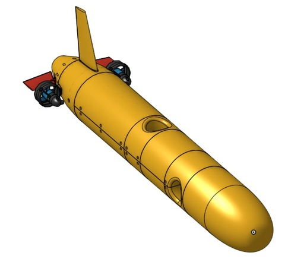

# Autonomous Underwater Vehicle (AUV) AIAPAEC in Gazebo Harmonic with ROS2 Iron

> Status: proof-of-concept, updated for Gazebo Harmonic binaries

This is a simulator of an overactuated AUV, named AIAPAEC, running in Gazebo Harmonic and ROS2 Iron. Moreover, it uses the following Gazebo plugins: the BuoyancyPlugin, the HydrodynamicsPlugin and the ThrusterPlugin.

# Requirements

The simulator run in Ubuntu 22.04.3 LTS version.

Install the Gazebo Harmonic following the instructions given below: 
* [Gazebo Harmonic 8.1.0](https://gazebosim.org/docs/harmonic/install)

Install the ROS Iron following the instructions given below:
* [ROS2 Iron](https://docs.ros.org/en/iron/index.html)

The three required Gazebo plugins are included in the Gazebo harmonic version.

# Download the simulator

To download and install the simulator AUV AIAPAEC follow the instructions.

1. Cloning the archives to GitHub

~~~bash
git clone https://github.com/Kevin1lg/AUV-AIAPAEC.git
colcon build
~~~

# Structure to folders

    ├── build                       # File compilated
    ├── install                     # File compilated
    ├── log                         # File compilated
    ├── src                         
    │   ├── aiapaec_models          # Models to world, Aiapaec AUV, axes, coast waves and sand heightmap
    │   ├── gz_transport_dvl        # Transport of messages from DVL, simulation time and real time to gz bridge
    │   ├── ros_pkg_aplication      # Nodes to ROS2
    │   └── ros_pkg_bringup         # Gz bridge configuration files and ROS2 launch files 
    
# Instruction to run the simulator

The simulator offers the open loop and closed loop operation modes. To demonstrate the performance of the simulator a three cases will be considered:

1. Open loop: the thrusters receive constant or predefined values from the **test_data** ROS node using the Gazebo bridge.

2. Closed loop: the thursters receive the data from control ROS node using Gazebo bridge. The control node recieves the data from the AUV simulator sensors using Gazebo bridge and executes a MIMO control algorithm to generate the trhusters commands automatically, and closing the loop. The user may select between two control nodes:

    - **control_odometry_data** : control with odometry data to 100 hz
    - **control_sensors_data** : control with IMU and DVL sensors data to 10 Hz

3. Zig-zag maneuver: The thursters receive the data from **zig_zag_commands** ROS node using Gazebo bridge. The **zig_zag_commands** node recieves the data from the AUV simulator sensors using Gazebo bridge and executes a conventional 30 degrees zig-zag maneuver, generating the trhusters commands automatically, and closing the loop. 

* Suggestions: This updated package enables three types of sensors plugins: IMU, DVL and odometry. The IMU provides angular positions and rates relative to the inertial frame, the DVL provides velocities relative to body frame and the odometry provides both features. To reduce computational effort, the user may select the odometry. 

To run the simulator using the following commands:

~~~bash
cd ws
colcon build
export GZ_SIM_RESOURCE_PATH=~/ws/src/aiapaec_models/models:~/ws/src/aiapaec_models/worlds
source install/setup.bash
ros2 launch ros_pkg_bringup aiapaec.launch.py
~~~

To run the control node using the sensor data use the following commands in an other terminal
~~~bash
cd ws
source install/setup.bash
ros2 launch ros_pkg_bringup sensor.launch.py
~~~
To run the control node using the odometry data use the following commands in an other terminal
~~~bash
cd ws
source install/setup.bash
ros2 launch ros_pkg_bringup odometry.launch.py
~~~
To run the zig-zag maneuver using the odometry data use the following commands in an other terminal
~~~bash
cd ws
source install/setup.bash
ros2 launch ros_pkg_bringup zig_zag.launch.py
~~~
To run the open-loop control use the following commands in an other terminal
~~~bash
cd ws
source install/setup.bash
ros2 launch ros_pkg_bringup open_loop.launch.py
~~~

* Suggestions: Before to run the control node, be sure to press play in Gazebo Harmonic simulator

# License

This project is licenced by GPL-3 license

# Thanks

Thanks to the National University of San Agustin of Arequipa and its Complex Process Control and Unmanned Vehicles Laboratory.

# References

* [Gazebo Theory Hydrodinamics](https://gazebosim.org/api/sim/8/theory_hydrodynamics.html) 
* [Gazebo Underwater Vehicles](https://gazebosim.org/api/sim/8/underwater_vehicles.html) 
* [Gz bridge](https://github.com/gazebosim/ros_gz/tree/ros2/ros_gz_bridge)
* [Gz transport](https://github.com/gazebosim/gz-transport/tree/gz-transport13)  
* [Odometry plugin](https://gazebosim.org/api/sim/8/classgz_1_1sim_1_1systems_1_1OdometryPublisher.html)
* [IMU plugin](https://gazebosim.org/api/sim/8/classgz_1_1sim_1_1systems_1_1Imu.html)

