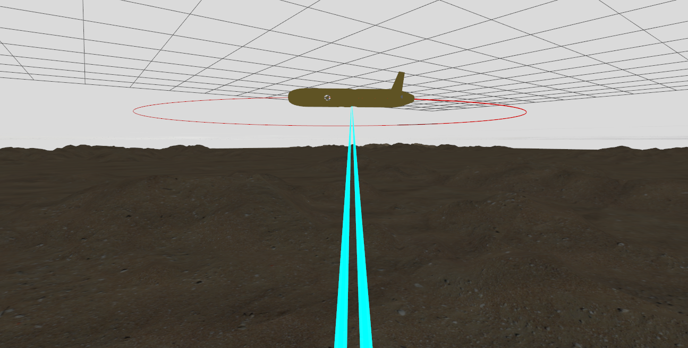

# Autonomous Underwater Vehicle (AUV) AIAPAEC Simulator V0.1

The AUV AIAPAEC Simulator is a complete simulator in an environment to 3D of an overactuated AUV, named AIAPAEC, running in Python, Gazebo Harmonic and ROS2 Iron. The simulator is implemented with LQY/LTR MIMO control.
[Demostrative Video](https://www.youtube.com/watch?v=cu-C-0CWZdo)

# Requirements

The simulator run in Ubuntu 22.04.3 LTS version.

Install the following modules and packages
~~~bash
pip install numpy
pip install matplotlib
pip install scipy 
~~~
~~~bash
pip install slycot==0.5.4
pip install control==0.9.4
~~~

Install the Gazebo Harmonic following the instructions given below: 
* [Gazebo Harmonic 8.1.0](https://gazebosim.org/docs/harmonic/install)

Install the ROS Iron following the instructions given below:
* [ROS2 Iron](https://docs.ros.org/en/iron/index.html)

The Gazebo plugins are included in the Gazebo harmonic version.

# Download the simulator

To download and install the AUV AIÁPAEC Simulator follow the instructions. 

1. Cloning the archives to GitHub

~~~bash
git clone https://github.com/Kevin1lg/AUV-AIAPAEC-Simulator.git
~~~

2. Compile and build files to Gazebo and Ros2 Simulator

~~~bash
cd AUV-AIAPAEC-Simulator/GZ_Simulator
colcon build
~~~

# Structure to folders
    ├── PyAUVsimulator
    │   ├── lib                                         # File compilated
    │   ├── lqg_control                                 # File compilated
    │   ├── lqg_control_image_outputs                   # File save results
    │   ├── non_linear_model                            # File compilated
    │   ├── non_linear_model_image_outputs              # File save results
    │   ├── real_state_space_and_discretized_control    # File save results
    │   ├── main.py  
    ├── GZ_Simulator                                   
    │   ├── build                                       # File compilated
    │   ├── install                                     # File compilated
    │   ├── log                                         # File compilated
    │   └── src                                         # Files to configuration in Gazebo and Ros
    │       ├── aiapaec_models                          # Models to world, Aiapaec AUV, axes, coast waves and sand heightmap
    │       ├── gz_transport_dvl                        # Transport of messages from DVL, simulation time and real time to gz bridge
    │       ├── ros_pkg_aplication                      # Nodes to ROS2
    │       └── ros_pkg_bringup                         # Gz bridge configuration files and ROS2 launch files 
    
# Instruction to run the simulator

The AUV AIAPAEC Simulator has two parts, the first, named PyAUVsimulator, is the synthesis to control LQY/LTR where its consider the non-linear model, the linearized model and the controller developed. The second, named GZ_Simulator, is the configuration to AUV in Gazebo Harmonic and Ros2 Iron, where its consider the AUV hydrodinamic and his probe the LQY/LTR MIMO control in an 3D environment.

The PyAUVsimulator encompasses modes for operating the nonlinear, linearized, and AUV control models. Demonstrating its functionality involves several steps: Thruster Distance Configuration, where the thruster distances (dp1, dp2, dp3) are adjusted; Nonlinear Model Visualization, which involves visualizing results using input signals representing thruster forces in Newton (Tp1, Tp2, Tp3); Linearized Model Application, where the nonlinear AUV model is linearized with initial values (X, U); and Controller Development, utilizing constants from the linearized model to calculate values crucial for controlling linear velocities in surge (u), sway (v), and the angular velocity in yaw (r).

To run PyAUVsimulator use the following commands:
~~~bash
cd AUV-AIAPAEC-Simulator/PyAUVsimulator
python main.py
ls
~~~

The GZ_Simulator offers the open loop and closed loop operation modes. To demonstrate the performance of the simulator three cases will be considered:

1. Open loop: The thrusters receive constant or predefined values from the **test_data** ROS node using the Gazebo bridge.

    File to launch : **test_data.launch.py**

2. Closed loop: The thursters receive the data from control ROS node using Gazebo bridge. The control node recieves the data from the AUV simulator sensors using Gazebo bridge and executes a MIMO control algorithm to generate the trhusters commands automatically, and closing the loop. The user may select between two control nodes:

    - **control_odometry_data** : control with odometry data to 100 hz, its launch file is **odometry.launch.py**
    - **control_sensors_data** : control with IMU and DVL sensors data to 10 Hz, its launch file is **sensor.launch.py**

3. Zig-zag maneuver: The thursters receive the data from **zig_zag_commands** ROS node using Gazebo bridge. The **zig_zag_commands** node recieves the data from the AUV simulator sensors using Gazebo bridge and executes a conventional 30 degrees zig-zag maneuver, generating the trhusters commands automatically, and closing the loop. 
    
    File to launch : **zig_zag.launch.py**

* Suggestions: This updated package enables three types of sensors plugins: IMU, DVL and odometry. The IMU provides angular positions and rates relative to the inertial frame, the DVL provides velocities relative to body frame and the odometry provides both features. To reduce computational effort, the user may select the odometry. 

To run the GZ_Simulator using the following commands:

~~~bash
cd /AUV-AIAPAEC-Simulator/GZ_Simulator/
export GZ_SIM_RESOURCE_PATH=~/AUV-AIAPAEC-Simulator/GZ_Simulator/src/aiapaec_models/models:~/AUV-AIAPAEC-Simulator/GZ_Simulator/ws/src/aiapaec_models/worlds
source install/setup.bash
ros2 launch ros_pkg_bringup aiapaec.launch.py
~~~

To run any to the four files to launch use the following commands.
~~~bash
cd AUV-AIAPAEC-Simulator/GZ_Simulator/
source install/setup.bash
ros2 launch ros_pkg_bringup 'launch file'
~~~

* Suggestions: Before to any the control node, be sure to press play in Gazebo Harmonic simulator

# License

This project is licenced by GPL-3 license

# Thanks

Thanks to the Universidad Nacional de San Agustín de Arequipa and its Complex Process Control and Unmanned Vehicles Laboratory.

# Contacts
- Diana Huallpa Apaza dhuallpapa@unsa.edu.pe
- Maria Huamani Chuma mhuamanichum@unsa.edu.pe
- Kevin Luque Gutierrez kluquegu@unsa.edu.pe
- Daniel Yanyachi Aco Cardenas dyanyanchi@unsa.edu.pe
- Juan Cutipa Luque jcutipalu@unsa.edu.pe

